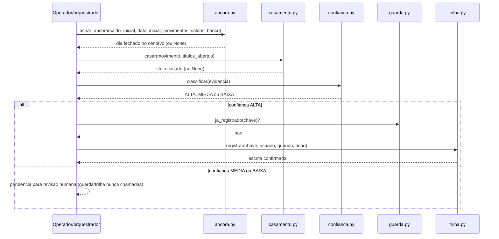
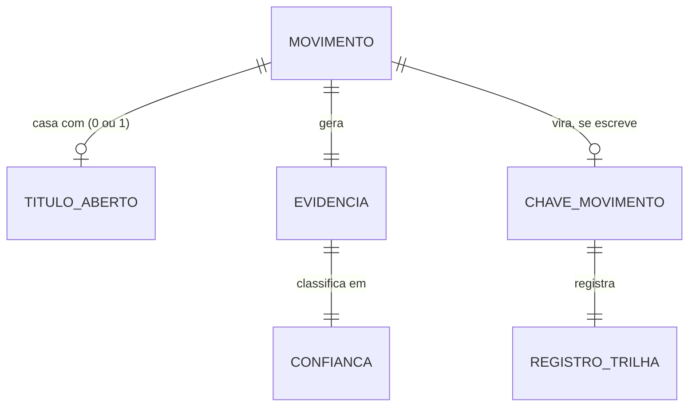

# Diagramas

A sequência mostra a ordem real de chamada dentro de um ciclo de conciliação, com o
**orquestrador** (quem compõe os cinco módulos — `test_fluxo_completo.py` no exemplo) como o
único participante que chama os outros: nenhum módulo importa ou chama outro diretamente (ver
`04-Arquitetura.md`), então nenhuma seta parte de `Cas`, `Conf`, `Grd` ou `Tri` para outro
módulo. A âncora roda primeiro e de forma independente do restante — ela responde "os saldos
batem no geral?", não "este movimento específico casa com o quê?" — e recebe também
`data_inicial_conhecida`, o parâmetro que ancora *quando* o saldo inicial valia (ver
`08-Modelos.md`). Casamento e confiança rodam por movimento, e só depois de a confiança
classificar como ALTA é que guarda e trilha entram, nessa ordem. Quando a confiança fica em
MEDIA ou BAIXA, o fluxo nunca chega a guarda ou trilha — comportamento coberto por
`test_fluxo_nao_escreve_quando_confianca_e_media`, que testa exatamente este ramo (o
teste `..._quando_confianca_e_baixa_por_falta_de_titulo` cobre um ramo diferente: quando não há
título candidato nenhum por valor).

## Entidades e relação

Um movimento casa com no máximo um título aberto — nunca mais de um, porque `casar()` sempre
devolve um único candidato ou `None`. A relação entre movimento e chave de escrita é opcional
porque nem todo movimento vira escrita: só os que atingem confiança ALTA chegam a ter uma
`ChaveMovimento` registrada na trilha, e essa é exatamente a fronteira que `06-Fluxogramas.md`
detalha como máquina de estados. A relação entre `EVIDENCIA` e `CONFIANCA` é sempre um-para-um e
sempre obrigatória — todo movimento casado gera uma evidência, e toda evidência é classificada,
mesmo quando o resultado é `BAIXA`; não existe estado intermediário em que um movimento casado
fique sem classificação. Essa obrigatoriedade é o que garante que a máquina de estados de
`06-Fluxogramas.md` nunca trave num nó sem saída definida.
