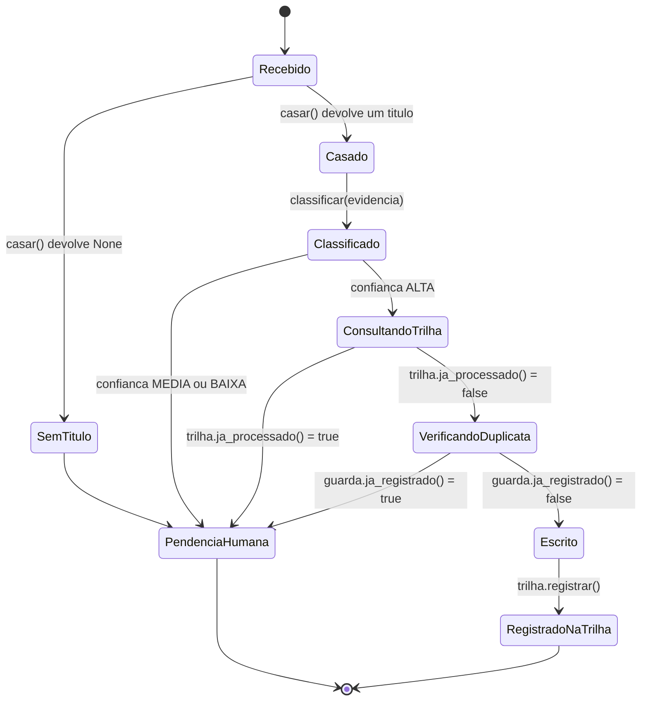

# Fluxogramas

O estado `Recebido` é o ponto de entrada de todo movimento bancário. Dali em diante existem
exatamente dois destinos finais: `RegistradoNaTrilha`, quando o movimento foi casado, classificado
como ALTA, não era duplicata (nem dentro da execução, nem entre execuções) e foi escrito; ou
`PendenciaHumana`, em qualquer um dos quatro pontos em que a máquina decide não prosseguir
sozinha — sem título casado, confiança insuficiente, chave já na trilha de uma execução
anterior, ou suspeita de duplicata dentro do lote corrente.

**Duas barreiras distintas, nesta ordem — correção de auditoria em 2026-08-20.** A versão
anterior deste diagrama só desenhava `guarda.ja_registrado()` como barreira, mas guarda é
memória volátil da execução corrente (ver `11-Implementacao.md`): ela não sabe o que uma
execução anterior já escreveu. Por isso `ConsultandoTrilha` vem primeiro — é a defesa contra
"rodar de novo o mesmo lote" entre execuções — e só depois `VerificandoDuplicata`, a defesa
contra duplicata dentro do MESMO lote (dois movimentos parecidos na mesma execução). O teste
`test_segunda_execucao_com_guarda_nova_e_trilha_antiga_nao_reescreve` prova por que a ordem
importa: com guarda nova (execução recém-iniciada) e trilha antiga (execução anterior), só a
consulta à trilha impede a reescrita — consultar só a guarda diria, errado, que a chave nunca
foi vista. Os testes de `test_guarda.py` continuam cobrindo `VerificandoDuplicata` isoladamente,
para que uma mudança no casamento ou na confiança nunca corrompa silenciosamente a garantia de
não duplicar dentro do lote.

## O caminho de decisão de confiança em detalhe

A transição de `Classificado` para `ConsultandoTrilha` (e, dali, para `VerificandoDuplicata`
quando a trilha não acusa processamento anterior) só acontece sob duas condições
alternativas, implementadas em `classificar()`: match exato de valor combinado com similaridade
de nome alta, ou histórico forte (fornecedor recorrente reconhecido pelo nome, com número mínimo
de ocorrências e dominância mínima do mesmo destino). A segunda condição existe para cobrir
casos em que o valor varia mas o fornecedor é sempre o mesmo — um débito de cartão recorrente,
por exemplo — e está coberta pelo teste
`test_historico_forte_promove_a_alta_mesmo_sem_valor_exato`. Nenhuma das duas condições, sozinha,
é permissiva o bastante para produzir falso positivo sistemático: a primeira exige os dois
sinais ao mesmo tempo, e a segunda exige volume e consistência histórica, não uma ocorrência
isolada — `test_ocorrencia_isolada_nao_vira_regra` prova essa fronteira.
