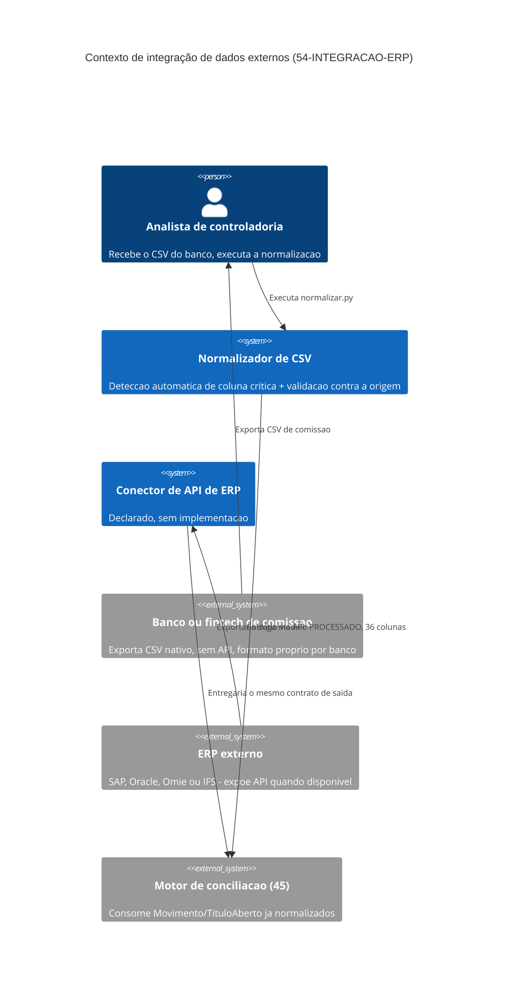

# Arquitetura

Duas rotas diferentes convergindo no mesmo contrato de saída — o modelo `PROCESSADO` de 36
colunas — é a decisão arquitetural central deste volume. A rota implementada hoje é a de
arquivo: um analista recebe o CSV do banco e executa `normalizar.py`. A rota declarada e não
implementada é a de API: um conector consultaria SAP, Oracle, Omie ou IFS diretamente. As duas
não precisam existir ao mesmo tempo para o desenho ser válido — o que importa é que quem consome
o resultado (`45-CONCILIACAO-CONTAS`) nunca precise saber qual das duas produziu o dado.

O diagrama mostra as duas origens externas — banco (sem API, hoje real) e ERP (com API,
aspiracional) — chegando ao mesmo destino, `45-CONCILIACAO-CONTAS`, pela mesma seta de saída.
Nenhuma seta liga o motor de conciliação diretamente a nenhuma das duas origens: a fronteira
declarada em `03-Escopo.md` está representada aqui como a ausência dessas setas, não só como
prosa. `conector_erp` aparece no diagrama mesmo sem código, porque a arquitetura já reserva o
lugar dele — é o tipo de decisão que este volume, por ser `ARQUITETURA` e não `ENGINE`, existe
para registrar antes de o código chegar, não depois.

## Por que não é um único componente

Um único módulo que decidisse "ler API se existir, senão ler CSV" pareceria mais simples, mas
esconderia dentro de si duas lógicas de erro completamente diferentes — falha de rede e
autenticação, contra CSV malformado e coluna ambígua — testáveis com estratégias incompatíveis
(mock de rede versus `DataFrame` em memória, como em `test_normalizar.py`). Manter os dois como
componentes separados que apenas compartilham o contrato de saída evita esse acoplamento.
